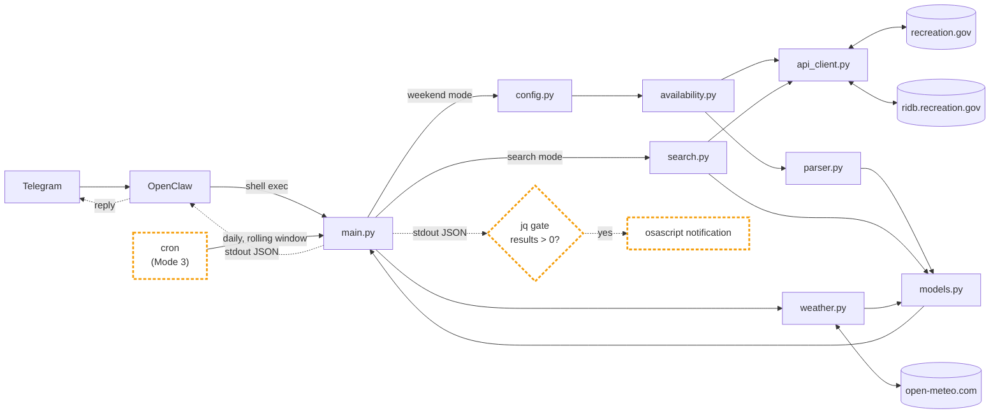

# Campsite Recon — Recreation.gov availability CLI + OpenClaw skill

A small Python CLI and OpenClaw skill that checks **Recreation.gov campsite and wilderness-permit availability** for any US campground, pairs it with a Fri/Sat/Sun weather forecast, and surfaces openings in Telegram. Built on the public RIDB directory API plus Recreation.gov's internal availability endpoints, with a cron watch mode that notifies you only when sites actually open.

**Three modes:**

1. **Weekend recon** — preset Bay Area / Central California locations (Point Reyes wilderness permits, Big Sur, Pinnacles, Kings Canyon, Sequoia) for the upcoming weekend, with weather (Recreation.gov + Open-Meteo).
2. **Free-text search** — any location (e.g. "Yosemite", "Tahoe", "Joshua Tree", "Zion") over an arbitrary date range, no weather. For planning trips months ahead.
3. **Watch (cron)** — daily check of a specific location with a rolling date window. Notifies only when sites open; silent otherwise. Full install walkthrough in [SKILL.md](SKILL.md) Mode 3.

All three output structured JSON consumed by OpenClaw → Telegram.

## What it answers

Typical queries, phrased how a user would actually type them:

- "Any campsites open in Point Reyes this weekend?"
- "Find me an open Yosemite campground over July 4th"
- "Check Big Sur next weekend and tell me the weather"
- "Watch Sequoia daily and ping me when a site opens up"
- "Are wilderness permits available for Coast Camp?"
- "Is Kirk Creek bookable Sat+Sun?"

If you're looking to monitor Recreation.gov availability from the command line — or to drop that ability into an LLM agent loop (OpenClaw, Claude Code, any shell-capable agent) and pipe the results into Telegram — this repo is the minimum viable version.

Recreation.gov has no public POST/PATCH endpoints, so **this tool cannot book sites for you**. It's read-only surveillance: poll availability, surface openings, let the human click through to book. Their iOS app has a native watch feature; this CLI replicates that inside an LLM/Telegram workflow so the same loop can handle free-text queries, cron polling, and weather in one place.

---

## How it works



Nodes with the dashed amber border (`cron`, `jq gate`, `osascript notification`) are shell orchestration configured by [SKILL.md](SKILL.md) Mode 3 — not Python code. The cron line just re-uses `main.py --search` on a schedule and gates the notification on non-empty results.

## Modules

Each row links to source and to a per-module wiki page. The wiki ([docs/](docs/)) is the curated, navigable layer for LLMs (and devs) who want context without reading every file — start at [docs/README.md](docs/README.md).

| File | Wiki | Responsibility |
|---|---|---|
| [main.py](main.py) | [docs/main.md](docs/main.md) | CLI entry point. Loads API key, routes between weekend + search modes, prints JSON to stdout |
| [recon/api_client.py](recon/api_client.py) | [docs/api_client.md](docs/api_client.md) | HTTP transport. Rec.gov availability endpoints + RIDB facility search. Knows nothing about campsites |
| [recon/availability.py](recon/availability.py) | [docs/availability.md](docs/availability.md) | Weekend mode: decides which endpoint to call; handles campground → permit fallback |
| [recon/parser.py](recon/parser.py) | [docs/parser.md](docs/parser.md) | Weekend mode: transforms raw responses into `CampsiteResult`, flags contiguous nights, guards permit URLs |
| [recon/search.py](recon/search.py) | [docs/search.md](docs/search.md) | Search mode: RIDB query → facility list → multi-month availability scan → `SearchReport` |
| [recon/weather.py](recon/weather.py) | [docs/weather.md](docs/weather.md) | Fetches Fri/Sat/Sun forecast from Open-Meteo. Returns `WeatherDay` per day |
| [recon/config.py](recon/config.py) | [docs/config.md](docs/config.md) | Preset location definitions with facility + permit IDs. Add new presets here only |
| [recon/models.py](recon/models.py) | [docs/models.md](docs/models.md) | Data contracts — `CampsiteResult`, `WeatherDay`, `LocationReport`, `SearchResult`, `SearchReport` |
| [SKILL.md](SKILL.md) | — | OpenClaw skill definition — copy to `~/.openclaw/skills/campsite-recon/` |

## Supported preset locations

| Key | Location |
|---|---|
| `point_reyes` | Point Reyes National Seashore (wilderness permits) |
| `big_sur` | Big Sur (drive-in campgrounds) |
| `pinnacles` | Pinnacles National Park |
| `kings_canyon` | Kings Canyon National Park |
| `sequoia` | Sequoia National Park |

To add a preset: look up the facility IDs on RIDB, add an entry to [recon/config.py](recon/config.py). Nothing else needs changing.

To check a location that isn't a preset, use search mode — no code change required.

## Usage

**Weekend mode** — presets + weather:

```bash
# All preset locations, upcoming weekend
python main.py

# Specific preset
python main.py --location point_reyes

# Specific weekend (pass the Friday)
python main.py --location big_sur --date 2026-05-01
```

**Search mode** — arbitrary location + date range, no weather:

```bash
# Yosemite over July 4th weekend
python main.py --search "Yosemite" --start 2026-07-03 --end 2026-07-05

# Cross-month range works too
python main.py --search "Tahoe" --start 2026-07-30 --end 2026-08-02
```

Search mode only hits the Recreation.gov campground endpoint — wilderness-permit-only facilities (Point Reyes pattern) are skipped. For those, use a preset.

**Watch mode** — cron-driven notifications, only when sites open:

Mode 3 is orchestration rather than a new CLI flag. You wrap the search-mode command in a crontab line that gates notifications on non-empty results with `jq`, so you never see "nothing available" noise — you only hear from it when a site actually opens. Install walkthrough lives in [SKILL.md](SKILL.md) Mode 3; short version:

```bash
# Daily at 8am, scan the next 30 days for Yosemite, notify only when results[] is non-empty
0 8 * * * cd /path/to/campsitescout && /usr/bin/env python3 main.py --search "Yosemite" \
  --start $(date -v+1d +\%Y-\%m-\%d) --end $(date -v+30d +\%Y-\%m-\%d) \
  | /opt/homebrew/bin/jq -e '.results | length > 0' >/dev/null \
  && osascript -e 'display notification "Open sites for Yosemite" with title "🏕 Campsite Scout"'
```

Swap `osascript` for a `curl` to a Telegram bot's `sendMessage` endpoint to route notifications into chat instead of a macOS banner. Cron only fires while the machine is awake — for 24/7 watching, host this on a server or GitHub Actions.

## OpenClaw setup

```bash
mkdir -p ~/.openclaw/skills/campsite-recon
cp SKILL.md ~/.openclaw/skills/campsite-recon/SKILL.md
```
