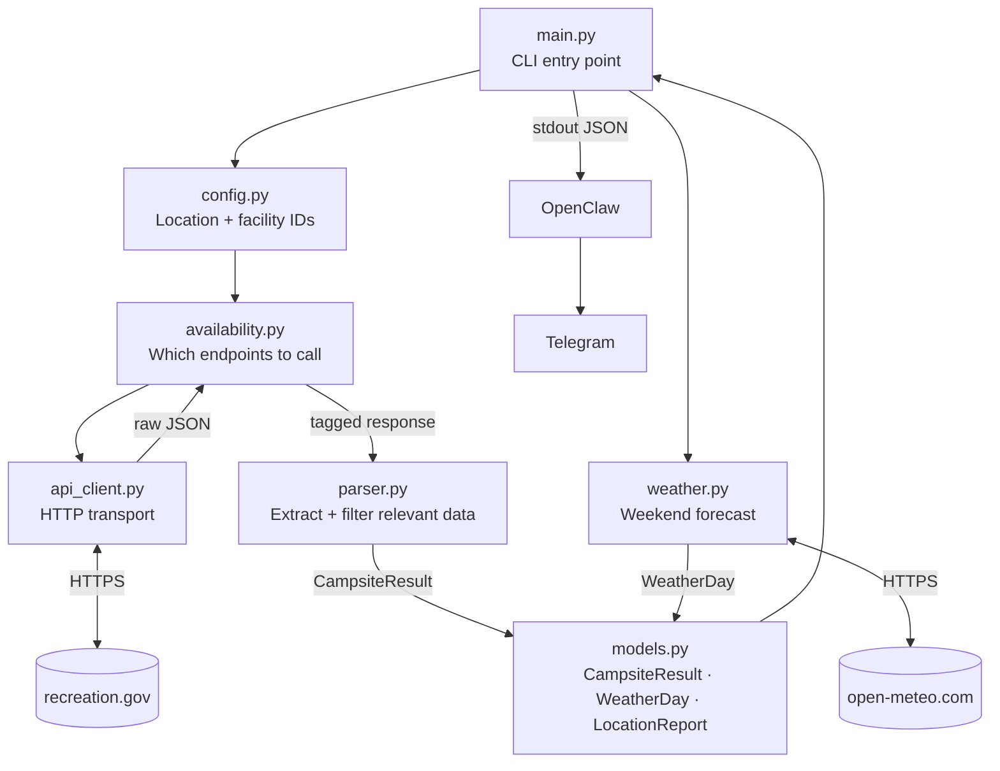

# Campsite Recon

Weekend campsite availability checker for Bay Area locations. Queries Recreation.gov and Open-Meteo, outputs structured JSON consumed by OpenClaw → Telegram.

---

## How it works



## Modules

| File | Responsibility |
|---|---|
| [recon/models.py](recon/models.py) | Data contracts — defines `CampsiteResult`, `WeatherDay`, `LocationReport` |
| [recon/config.py](recon/config.py) | Location definitions with facility + permit IDs. Add new locations here only |
| [recon/api_client.py](recon/api_client.py) | HTTP transport to recreation.gov. Knows nothing about campsites |
| [recon/availability.py](recon/availability.py) | Decides which endpoint to call; handles campground → permit fallback |
| [recon/parser.py](recon/parser.py) | Transforms raw API responses into `CampsiteResult`. Filters non-bookable sites |
| [recon/weather.py](recon/weather.py) | Fetches Fri/Sat/Sun forecast from Open-Meteo. Returns `WeatherDay` per day |
| [main.py](main.py) | CLI entry point. Orchestrates all modules, prints JSON to stdout |
| [SKILL.md](SKILL.md) | OpenClaw skill definition — copy to `~/.openclaw/skills/campsite-recon/` |

## Supported locations

| Key | Location |
|---|---|
| `point_reyes` | Point Reyes National Seashore (wilderness permits) |
| `big_sur` | Big Sur (drive-in campgrounds) |

To add a location: look up the facility IDs on RIDB, add an entry to [recon/config.py](recon/config.py). Nothing else needs changing.

## Usage

```bash
# All locations, upcoming weekend
python main.py

# Specific location
python main.py --location point_reyes

# Specific weekend (pass the Friday)
python main.py --location big_sur --date 2026-05-01
```

## API key

Stored in macOS Keychain — never hardcoded:
```bash
security add-generic-password -a "$USER" -s "recreation-gov-api" -w "<YOUR_KEY>"
```

## OpenClaw setup

```bash
mkdir -p ~/.openclaw/skills/campsite-recon
cp SKILL.md ~/.openclaw/skills/campsite-recon/SKILL.md
```
