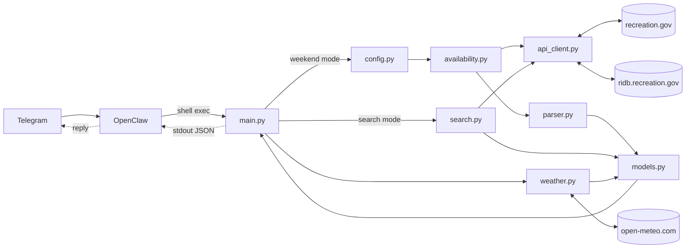

# Campsite Recon

Two modes:
1. **Weekend recon** — preset Bay Area locations, upcoming weekend, with weather (Recreation.gov + Open-Meteo).
2. **Free-text search** — any location (e.g. "Yosemite") over an arbitrary date range, no weather. For planning trips months ahead.

Both output structured JSON consumed by OpenClaw → Telegram.

---

## How it works



## Modules

| File | Responsibility |
|---|---|
| [recon/models.py](recon/models.py) | Data contracts — `CampsiteResult`, `WeatherDay`, `LocationReport`, `SearchResult`, `SearchReport` |
| [recon/config.py](recon/config.py) | Preset location definitions with facility + permit IDs. Add new presets here only |
| [recon/api_client.py](recon/api_client.py) | HTTP transport. Rec.gov availability endpoints + RIDB facility search. Knows nothing about campsites |
| [recon/availability.py](recon/availability.py) | Weekend mode: decides which endpoint to call; handles campground → permit fallback |
| [recon/parser.py](recon/parser.py) | Weekend mode: transforms raw responses into `CampsiteResult`, filters non-bookable, flags contiguous nights |
| [recon/search.py](recon/search.py) | Search mode: RIDB query → facility list → multi-month availability scan → `SearchReport` |
| [recon/weather.py](recon/weather.py) | Fetches Fri/Sat/Sun forecast from Open-Meteo. Returns `WeatherDay` per day |
| [main.py](main.py) | CLI entry point. Routes between weekend + search modes, prints JSON to stdout |
| [SKILL.md](SKILL.md) | OpenClaw skill definition — copy to `~/.openclaw/skills/campsite-recon/` |

## Supported preset locations

| Key | Location |
|---|---|
| `point_reyes` | Point Reyes National Seashore (wilderness permits) |
| `big_sur` | Big Sur (drive-in campgrounds) |
| `pinnacles` | Pinnacles National Park |
| `kings_canyon` | Kings Canyon National Park |
| `sequoia` | Sequoia National Park |

To add a preset: look up the facility IDs on RIDB, add an entry to [recon/config.py](recon/config.py). Nothing else needs changing.

To check a location that isn't a preset, use search mode — no code change required.

## Usage

**Weekend mode** — presets + weather:

```bash
# All preset locations, upcoming weekend
python main.py

# Specific preset
python main.py --location point_reyes

# Specific weekend (pass the Friday)
python main.py --location big_sur --date 2026-05-01
```

**Search mode** — arbitrary location + date range, no weather:

```bash
# Yosemite over July 4th weekend
python main.py --search "Yosemite" --start 2026-07-03 --end 2026-07-05

# Cross-month range works too
python main.py --search "Tahoe" --start 2026-07-30 --end 2026-08-02
```

Search mode only hits the campground endpoint — wilderness-permit-only facilities (Point Reyes pattern) are skipped. For those, use a preset.

## OpenClaw setup

```bash
mkdir -p ~/.openclaw/skills/campsite-recon
cp SKILL.md ~/.openclaw/skills/campsite-recon/SKILL.md
```
